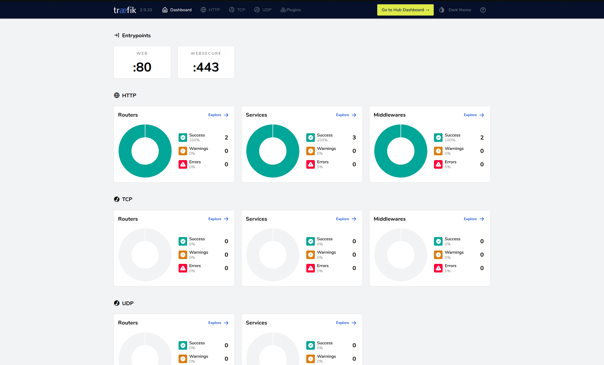

# Traefik Reverse Proxy

Traefik reverse proxy running in Docker Swarm

## Prepare the environment

`cd` into home directory: `cd ~`.

Create the following directories:

`mkdir -p config/traefik/log`

Create the proxy network (`web`) used by all internet exposed services:

`docker network create --driver overlay --subnet 192.168.0.0/24 --gateway 192.168.0.254 --attachable web`

Create a private (internal) network for services which are not exposed to the web.

`docker network create --driver overlay --subnet 192.168.1.0/24 --gateway 192.168.1.254 --attachable lan`

Prepare the `acme.json` and `traefik.log` files:

`touch config/traefik/acme.json`
`touch config/traefik/log/traefik.log`
`chmod 600 config/traefik/acme.json`
`chmod 600 config/traefik/log/traefik.log`

## Configuration

### Static configuration file

Create the configuration file: `traefik.toml`

Replace the email address in the  `email = "email@example.com"` line and uncomment the `caServer = "https://acme-staging-v02.api.letsencrypt.org/directory"` line during testing (comment out in production).

**IMPORTANT**

If you used the staging server for testing Let's Encrypt, empty the "acme.json" file before commenting out the "staging" line.

### Dynamic configuration file

[Create password credentials for "htaccess" and "htpasswd" files](https://www.web2generators.com/apache-tools/htpasswd-generator).

Create the dynamic configuration file: `traefik_dynamic.toml`

Replace "proxy.example.com" with the real subdomain.

### Docker Compose file

Create the configuration file: `traefik.yml`

## Start the service

Deploy the Traefik application:

`docker stack deploy traefik --compose-file config/traefik/traefik.yml`

Confirm the application is running without errors:

`docker stack ps traefik`

Output:

```
ID             NAME                IMAGE          NODE        DESIRED STATE   CURRENT STATE            ERROR     PORTS
622ljp2qu8yk   traefik_traefik.1   traefik:2.10   moby-dick   Running         Running 29 minutes ago             
```

Use the `--no-trunk` option if there are any errors, so all the output is printed on the screen.

`docker stack ps --no-trunc traefik`


Open the browser and go to: "<https://proxy.example.com>"; enter the credentials when prompted. There should be  two Routers, three Services, and two Middlewares showing in the Dashboard.


